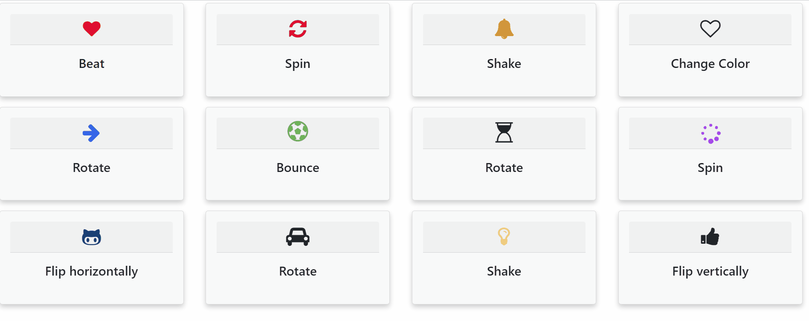

<div id="home" align="left"></div>

# 🤹‍♀️ Animating Icons

> Animating icons using CSS and JS!

| [<br /><sub>Animating Icons</sub>](demo/demo_animating_icons.gif)<br /> | 
| :---: |

## Technologies and Languages 💻

<div style="display: inline_block">
  
  
    
  
</div> <br/>

**Icons**
<div style="display: inline_block">
  
</div> <br/>

## Installation Steps 🛠️

You don't need to do anything to see and use this template. Then, clone the repository

```bash
# Clone the repository
$ git clone https://github.com/arianacabral/Animating-Icons.git
```

## Details 🔭

Notepad, [Notepad++](https://notepad-plus-plus.org/) or [VS Code](https://code.visualstudio.com/) can be used to make changes.

Modify the html file [``index.html``](https://github.com/arianacabral/Animating-Icons/blob/main/index.html) to change the elements or add new ones. You can also style your portfolio by modifying the CSS file  [``index.css``](https://github.com/arianacabral/Animating-Icons/blob/main/index.css).

## Contact 📬

For more information or questions, please contact me

<div> 
  <a href="https://github.com/arianacabral" target="_blank"></a>
  <a href = "mailto:arianacabral57@ufu.br"></a>
  <a href="https://discord.gg/RTXE2NMVSA" target="_blank"></a> 
</div>

</br>

<div align="right">
    <b><a href="#home">▲ top</a></b>
